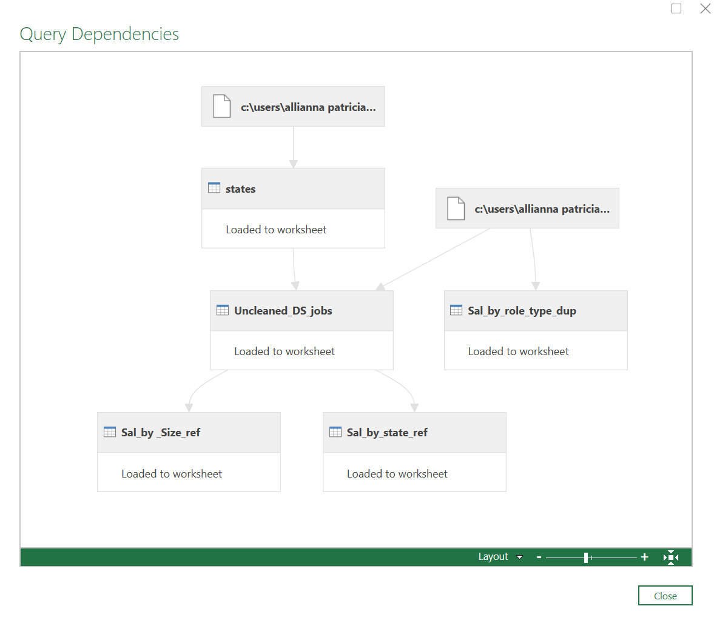

# Midterm Lab Task 2 - Data Cleaning and Transformation using POWER QUERY
In this lab, I worked on cleaning and organizing a messy dataset using Excel's Power Query. The dataset, Uncleaned_DS_Jobs.csv, was taken from a job posting site on Kaggle. The goal was to extract useful insights by performing data cleaning and transformation tasks.
## Data Cleaning Process
- Removed unnecessary characters from salary data to extract minimum and maximum values.
- Classified job roles into five categories (Data Scientist, Data Analyst, Data Engineer, Machine Learning Engineer, Other).
- Separated location data to extract state information.
- Removed missing values, duplicates, and irrelevant data for accuracy.
- Cleaned company names by removing extra characters and ratings.
## Data Transformation
- Grouped salary data by job role and company size to calculate salary averages.
- Merged state abbreviations with full names for better readability.
- Standardized salary figures by converting them into thousands.
## Here's the screenshot of my output before I started data cleaning (See screenshot

## Here's the screenshot of my output before after I started data cleaning (See screenshot

## Here's the screenshot of my Query Dependencies

